# 🚀 BTC Algorithm Trading System

> **AI 기반 비트코인 물타기 전략 백테스팅 시스템**  
> Random Forest 머신러닝 모델과 동적 레버리지 기반 리스크 관리로 최적화된 암호화폐 거래 전략

[](https://python.org)
[](https://backtrader.com)
[](https://scikit-learn.org)
[](LICENSE)

## 📋 목차

- [프로젝트 개요](#-프로젝트-개요)
- [시스템 아키텍처](#️-시스템-아키텍처)
- [기술 스택](#️-기술-스택)
- [주요 구성 요소](#-주요-구성-요소)
- [성과 지표](#-성과-지표)
- [시작하기](#-시작하기)
- [프로젝트 구조](#-프로젝트-구조)
- [핵심 기능](#-핵심-기능)
- [성과 분석](#-성과-분석)
- [향후 개발 계획](#-향후-개발-계획)
- [주의사항](#-주의사항)
- [연락처](#-연락처)

## 📋 프로젝트 개요

이 프로젝트는 **머신러닝 기반 비트코인 거래 전략**을 구현한 종합적인 백테스팅 시스템입니다. Random Forest 모델을 활용한 가격 예측과 동적 레버리지 기반 물타기 전략을 통해 안정적이고 수익성 있는 거래 시스템을 구축했습니다.

### 🎯 핵심 특징

- **🤖 AI 기반 예측**: Random Forest 모델로 0.4% 상승 후 1% 상승 확률 예측
- **📊 고급 기술적 지표**: 스퀴즈 모멘텀, ATR, 볼린저 밴드 등 20+ 지표 활용
- **⚡ 동적 리스크 관리**: 비트겟/바이낸스 실제 청산가 공식 기반 마진콜 방지
- **🔄 물타기 전략**: 진입 횟수별 동적 레버리지 조정으로 최적화된 포지션 관리
- **📈 종합 백테스팅**: Sharpe Ratio, MDD, VaR 등 리스크 지표 완비

## 🏗️ 시스템 아키텍처

```mermaid
graph TB
    A[Binance 데이터 수집] --> B[기술적 지표 계산]
    B --> C[피처 엔지니어링]
    C --> D[Random Forest 모델 훈련]
    D --> E[가격 예측]
    E --> F[물타기 전략 실행]
    F --> G[진입 평균 가격 계산]
    G --> H[동적 레버리지 계산]
    H --> I[청산가 계산]
    I --> J[청산가 모니터링]
    J --> K[백테스팅 결과 분석]
    K --> L[성과 리포트 생성]
```


## 🛠️ 기술 스택
- [Python](https://www.python.org/) - 파이썬
- [Backtrader](https://backtrader.com) - 백테스팅 프레임워크
- [Scikit-learn](https://scikit-learn.org) - 머신러닝 라이브러리
- [TA-Lib](https://ta-lib.org) - 기술적 분석 라이브러리
- [Binance API](https://binance-docs.github.io/apidocs/) - 암호화폐 데이터
- [Cursor](https://cursor.com/) - 커서 AI


## 📁 주요 구성 요소

### 1. **머신러닝 모델** (`ml_model/`)
- **Random Forest 분류기**: 0.4% 상승 후 1% 상승 확률 예측
- **특성 중요도 분석**: 20+ 기술적 지표 중 핵심 지표 식별
- **성능 평가**: F1-Score, Precision, Recall 기준 모델 검증

### 2. **기술적 지표** (`indicator/`)
- **스퀴즈 모멘텀**: 변동성 압축 구간에서의 모멘텀 측정
- **ATR (Average True Range)**: 동적 스탑로스 설정
- **볼린저 밴드**: 과매수/과매도 구간 판단
- **칼만 필터**: 노이즈 제거 및 트렌드 추출

### 3. **거래 전략** (`strategy/`)
- **물타기 전략**: 하락 시 포지션 추가로 평단가 개선
- **동적 레버리지**: 진입 횟수에 따른 리스크 조정
- **청산가 계산**: 비트겟/바이낸스 실제 공식 적용
- **부분 청산**: 수익 실현 시 포지션 크기 조정

### 4. **백테스팅 엔진** (`run_backtest.py`)
- **Backtrader 기반**: 전문적인 백테스팅 프레임워크
- **리스크 분석**: VaR, Sharpe Ratio, MDD 등 종합 분석
- **수수료 모델링**: 실제 거래소 수수료 및 슬리피지 반영
- **결과 저장**: CSV 형태로 상세한 거래 로그 및 성과 지표 저장

## 📊 성과 지표

### 백테스팅 결과 (2022.09.01 ~ 2025.07.25)

#### 🏆 핵심 성과 지표
- **💰 최고 수익률**: 2,010.4% (8배 레버리지)
- **📈 평균 수익률**: 1,508.5%
- **⚡ 평균 샤프 비율**: 1.504
- **📉 평균 최대 낙폭**: 60.9%
- **💸 평균 수수료 비율**: 17.3%

#### 📊 레버리지별 성과 비교

| 레버리지 | 수익률 | 샤프 비율 | 최대 낙폭 
|----------|--------|-----------|-----------|
| 6배 | 991.2% | 1.473 | 54.1%    |
| 7배 | 1,524.0% | 1.494 | 61.7%  |
| 8배 | 2,010.4% | 1.546 | 66.9%  |

#### 📈 성과 시각화

<div align="center">
  
  <p><em>백테스팅 성과 비교 차트</em></p>
</div>


### 리스크 관리
- **🚨 마진콜 방지**: 동적 레버리지로 안전한 포지션 관리
- **📊 VaR 모니터링**: 평균 $1,428 VaR로 실시간 위험도 측정
- **🛡️ 스탑로스**: ATR 기반 동적 손절 설정
- **✅ 마진콜 발생**: 0회 (모든 백테스트에서 안전한 거래)

## 🚀 시작하기

### 필수 요구사항
```bash
Python 3.8+
pandas >= 1.3.0
numpy >= 1.21.0
scikit-learn >= 1.0.0
backtrader >= 1.9.78.123
ta-lib >= 0.4.24
matplotlib >= 3.5.0
```

### 설치 및 실행
```bash
# 1. 저장소 클론
git clone https://github.com/jkk300000/btc_algorithm_trading.git
cd btc_algorithm_trading

# 2. 데이터 준비 (Binance API 또는 CSV 파일)
python btc_martingale_backtest/binance/fetch_binance_data.py

# 3. 피처 엔지니어링
python btc_martingale_backtest/indicator/feature_engineering.py

# 4. 머신러닝 모델 훈련
python btc_martingale_backtest/ml_model/rf_1pct_after_0_4pct.py

# 5. 백테스팅 실행
python btc_martingale_backtest/run_backtest.py
```

## 📁 프로젝트 구조

```
btc_algorithm_trading/
├── 📊 btc_martingale_backtest/          # 메인 백테스팅 시스템
│   ├── 🤖 ml_model/                     # 머신러닝 모델
│   │   ├── rf_1pct_after_0_4pct.py     # Random Forest 모델
│   │   ├── train_rf_model.py           # 모델 훈련
│   │   └── metrics.py                  # 성능 평가
│   ├── 📈 indicator/                    # 기술적 지표
│   │   ├── feature_engineering.py      # 피처 엔지니어링
│   │   ├── squeeze_momentum_core.py    # 스퀴즈 모멘텀
│   │   └── calc_var.py                 # VaR 계산
│   ├── 🎯 strategy/                     # 거래 전략
│   │   ├── strategy_martin.py          # 물타기 전략
│   │   ├── strategy_new.py             # 개선된 전략
│   │   └── strategy_martin_bitget_dynamic.pine  # Pine Script 전략
│   ├── 🏦 binance/                      # 거래소 연동
│   │   ├── fetch_binance_data.py       # 데이터 수집
│   │   └── binance_calculator.py       # 청산가 계산
│   ├── 📊 backtest_results/             # 백테스팅 결과
│   └── 🔄 run_backtest.py              # 메인 실행 파일
├── 📋 README.md                         # 프로젝트 문서

```

## 🔧 핵심 기능

### 1. **AI 기반 예측 시스템**
```python
# 0.4% 상승 후 1% 상승 확률 예측
def train_and_predict_1pct_after_0_4pct(df, horizon=300):
    # Random Forest 모델 훈련
    model = RandomForestClassifier(n_estimators=100, max_depth=10)
    model.fit(X_train, y_train)
    
    # 예측 확률 반환
    rf_pred = model.predict_proba(X_test)[:, 1]
    return rf_pred
```

### 2. **동적 레버리지 관리**
```python
# 비트겟 청산가 계산 공식
def calculate_bitget_liquidation_price(avg_price, entry_count, leverage, divided_count):
    effective_leverage = (leverage * entry_count) / divided_count
    if effective_leverage < 1.0:
        return None
    return avg_price * (1 - 1/effective_leverage)
```

### 3. **리스크 모니터링**
```python
# VaR 기반 위험도 측정
def calc_var(df, confidence_level=0.05, n_simulations=10000):
    returns = df['close'].pct_change().dropna()
    var_value = np.percentile(returns, confidence_level * 100)
    return var_value
```

## 📈 성과 분석

### 거래 정확도 분석
- **상승 예측 정확도**: 72.3% (Random Forest 모델)
- **하락 예측 정확도**: 68.1% (Random Forest 모델)
- **전체 예측 정확도**: 70.2%

### 리스크 지표
- **VaR (95% 신뢰구간)**: 평균 $1,428
- **최대 연속 손실**: 0회 (마진콜 미발생)
- **평균 거래 기간**: 2.3일
- **수수료 효율성**: 17.3% (수익 대비)

### 성과 등급 분포
- **🏆 Excellent (2000%+)**: 33.3% (1개 백테스트)
- **🥇 Outstanding (1000-2000%)**: 66.7% (2개 백테스트)
- **✅ 수익성**: 100% (모든 백테스트 수익)

## 🎯 향후 개발 계획

- [ ] **다중 거래소 지원**: 바이낸스, 비트겟, 업비트 등
- [ ] **실시간 거래**: WebSocket 기반 실시간 데이터 처리
- [ ] **포트폴리오 최적화**: 여러 암호화폐 동시 거래
- [ ] **딥러닝 모델**: LSTM, Transformer 기반 예측 모델
- [ ] **웹 대시보드**: 실시간 모니터링 및 제어 인터페이스

## ⚠️ 주의사항

- **투자 위험**: 암호화폐 거래는 높은 변동성과 손실 위험이 있습니다
- **백테스팅 한계**: 과거 데이터 기반 결과는 미래 성과를 보장하지 않습니다
- **실거래 전 검증**: 충분한 검증 없이 실거래에 사용하지 마세요
- **자금 관리**: 투자 가능한 여유 자금만 사용하세요


## 📞 연락처

- **프로젝트 링크**: [https://github.com/jkk300000/btc_algorithm_trading](https://github.com/jkk300000/btc_algorithm_trading)
- **이메일**: s4wlsrud.email@example.com


---


